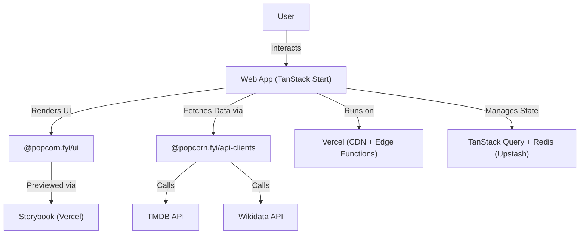

## **System Design**

---

## **Overview**

**Popcorn.fyi** is a fast, modular, and scalable movie discovery platform. It uses a **monorepo** powered by **Turborepo** and modern web technologies for a seamless developer and user experience.

---

## **🔹 Key Components**

1. **Frontend:** Built with **TanStack Start**, **TailwindCSS**, and **DaisyUI**.
2. **UI Library:** `@popcorn.fyi/ui` – Reusable components previewed via **Storybook** on **Vercel**.
3. **API Clients:** `@popcorn.fyi/api-clients` – Unified layer for fetching data from **TMDB**, **Wikidata**, and **OpenAI**.
4. **State & Caching:** Powered by **TanStack Query** and **Upstash Redis**, using **dynamic TTLs** based on release year.
5. **CI/CD:** Handled via **GitHub Actions** with deployment on **Vercel**.
6. **Testing:** Comprehensive coverage using **Vitest** (unit), **React Testing Library**, and **Playwright** (E2E).
