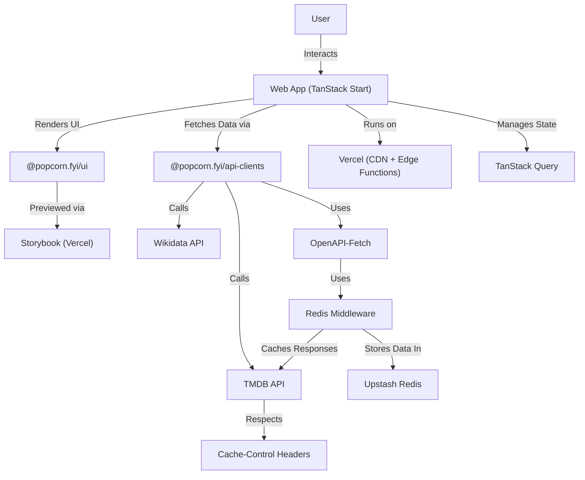

## **System Design**

---

## **Overview**

`popcorn.fyi` is a read-only, server-rendered web app built with TanStack Start. It uses a thin API client layer to fetch data from TMDB and Wikidata, with Redis-based server-side caching applied to TMDB responses. Client-side state is managed by TanStack Query, and all frontend UI is composed from a shared component library (`@popcorn.fyi/ui`). The app is deployed via Vercel, with CI/CD powered by GitHub Actions.

---

## Key Components

1. **Frontend:** Built with **TanStack Start**, **TailwindCSS**, and **DaisyUI**.
2. **UI Library:** `@popcorn.fyi/ui` – Reusable components previewed via **Storybook** on **Vercel**.
3. **API Clients:** `@popcorn.fyi/api-clients` – Unified layer for fetching data from **TMDB** and **Wikidata**.
4. **HTTP Client:** **OpenAPI-Fetch** with custom Redis caching middleware (currently used only for **TMDB**).
5. **State Management:**
   - **TanStack Query** for client-side state and caching
   - Handles query deduplication and revalidation on the client

6. **Server-Side Caching:**
   - Redis (Upstash) is used to cache **TMDB** responses only
   - **Wikidata** responses are **not cached** at this time

7. **CI/CD:** Handled via **GitHub Actions** with deployment on **Vercel**.
8. **Testing:** Comprehensive coverage using **Vitest** (unit), **React Testing Library**, and **Playwright** (E2E).

---

## Caching Strategy

### Two-Layer Caching:

1. **Client-Side (TanStack Query):**
   - `staleTime: 5 minutes` – Prevents unnecessary refetches
   - `refetchOnWindowFocus: false` – Reduces API calls
   - Designed for smooth and responsive user experience

2. **Server-Side (Redis via API Clients):**
   - **TMDB** HTTP responses cached using Redis
   - Respects `cache-control` headers (e.g., `max-age=21092` → \~6 hours)
   - Falls back to 1-hour TTL if headers are missing
   - **Wikidata is not cached** yet, but may be added in the future
