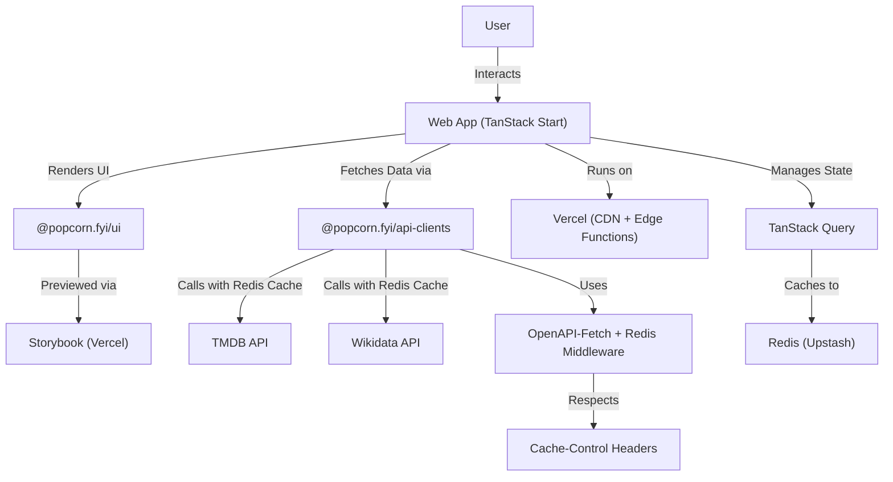

## **System Design**

---

## **Overview**

**Popcorn.fyi** is a fast, modular, and scalable movie discovery platform. It uses a **monorepo** powered by **Turborepo** and modern web technologies for a seamless developer and user experience.

---

## Key Components

1. **Frontend:** Built with **TanStack Start**, **TailwindCSS**, and **DaisyUI**.
2. **UI Library:** `@popcorn.fyi/ui` – Reusable components previewed via **Storybook** on **Vercel**.
3. **API Clients:** `@popcorn.fyi/api-clients` – Unified layer for fetching data from **TMDB**, **Wikidata**, and **OpenAI**.
4. **HTTP Client:** **OpenAPI-Fetch** with custom Redis caching middleware for all external API calls.
5. **State & Caching:**
   - **TanStack Query** for client-side state management with optimized `staleTime` settings
   - **Upstash Redis** for server-side HTTP response caching.
6. **CI/CD:** Handled via **GitHub Actions** with deployment on **Vercel**.
7. **Testing:** Comprehensive coverage using **Vitest** (unit), **React Testing Library**, and **Playwright** (E2E).

---

## Caching Strategy

### Two-Layer Caching:

1. **Client-Side (TanStack Query):**
   - `staleTime: 5 minutes` - Prevents unnecessary refetches
   - `refetchOnWindowFocus: false` - Reduces API calls
   - Optimized for user experience and performance

2. **Server-Side (Redis):**
   - Caches HTTP responses from TMDB and Wikidata
   - Uses API-provided `cache-control` headers for TTL
   - Example: `max-age=21092` (~6 hours for TMDB movie data)
   - Automatic fallback to 1-hour TTL if no cache headers
