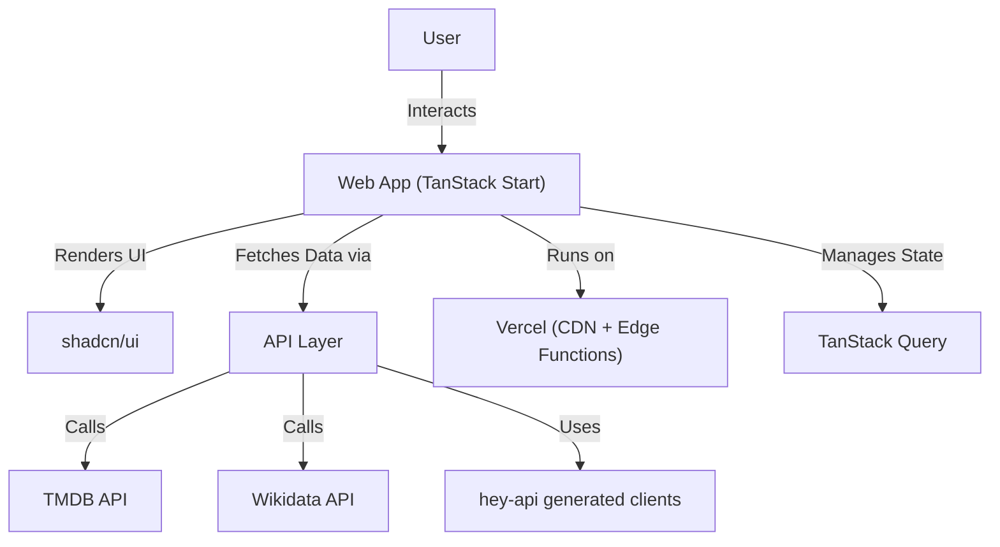

# System Design

```mermaid
graph TD;
    A[User] -->|Interacts| B["Web App (TanStack Start)"]
    B -->|Renders UI| J["shadcn/ui"]
    B -->|Fetches Data via| C["API Layer"]
    C -->|Calls| D["TMDB API"]
    C -->|Calls| E["Wikidata API"]
    C -->|Uses| F["hey-api generated clients"]
    B -->|Runs on| H["Vercel (CDN + Edge Functions)"]
    B -->|Manages State| I["TanStack Query"]
```

---

## Overview

`popcorn.fyi` is a read-only, server-rendered web app built with TanStack Start. It uses a thin API layer to fetch data from TMDB and Wikidata using **hey-api**-generated OpenAPI clients. Client-side state is managed by TanStack Query, and all frontend UI is composed from `tailwindcss` and **shadcn/ui**. The app is deployed via Vercel, with CI/CD powered by GitHub Actions.

---

## Key Components

1. **Frontend:** Built with **TanStack Start**, **TailwindCSS**, and **shadcn/ui**.
2. **API Layer:** Unified functions for fetching data from **TMDB** and **Wikidata**.
3. **HTTP Client:** **@hey-api/openapi-ts** clients (via **@hey-api/vite-plugin**), typed from each API’s OpenAPI spec.
4. **State Management:**
   - **TanStack Query** for client-side state and caching
   - Handles query deduplication and revalidation on the client

5. **CI/CD:** Handled via **GitHub Actions** with deployment on **Vercel**.
6. **Testing:** Comprehensive coverage using **Vitest** (unit), **React Testing Library**, and **Playwright** (E2E).

---

## Caching Strategy

### Client-side (TanStack Query)

- `staleTime: 5 minutes` – Prevents unnecessary refetches
- `refetchOnWindowFocus: false` – Reduces API calls
- Designed for smooth and responsive user experience
