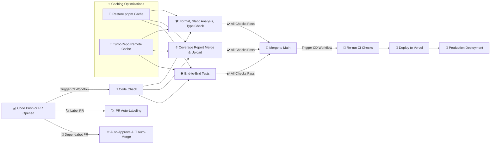

# 🚀 CI/CD Pipeline for popcorn.fyi

## 🔍 Overview

When I built _popcorn.fyi_, I wanted a CI/CD setup that was **fast, reliable, and low-maintenance**—something that wouldn’t slow me down but would still enforce code quality. The result? A **GitHub Actions-powered pipeline** that handles **code checks, linting, tests, PR labeling, dependency updates, test coverage tracking, and automatic deployments to Vercel**.

## 🏗️ Architecture

Here’s the high-level view:

1. **🔧 GitHub Repo:** The project is fully managed on GitHub.
2. **🔄 CI Workflows:** Every PR triggers GitHub Actions to enforce code quality.
3. **📦 Dependency Updates:** Dependabot keeps packages up to date with auto-merge.
4. **🏷️ PR Labeling:** GitHub Labeler auto-tags PRs based on file changes.
5. **📊 Coverage Tracking:** Codecov tracks and merges test coverage reports.
6. **🚚 Auto Deployments:** Merging to `main` triggers an automatic Vercel deployment.

## 🔁 Workflow Breakdown

### 1. **🧪 CI Workflow**

Runs automatically on PRs to ensure nothing breaks:

- **📝 Code Check:** Runs linting, type checking, and static analysis (`pnpm check`).
- **☂️ Coverage Reporting:** Merges reports and uploads them to Codecov.
- **🌐 E2E Tests:** Uses Playwright for full browser-based testing.

[View CI Workflow](/.github/workflows/ci.yml)

### 2. **🏷️ PR Labeling**

Automates PR categorization based on modified files:

- **🔄 Auto-label PRs** (e.g., `lib:api-clients` for API changes).
- **📂 Keeps labels up-to-date** as PRs evolve.

[View Labeler Workflow](/.github/workflows/label-prs.yml)

### 3. **📦 Dependabot Workflow**

Keeps dependencies fresh and secure:

- **✅ Auto-Approve:** Automatically approves Dependabot PRs.
- **🔀 Auto-Merge:** Merges updates when checks pass.

[View Dependabot Workflow](/.github/workflows/dependabot.yml)

### 4. **🚚 CD Workflow**

Triggers when a PR merges to `main`:

- **🔁 Runs CI Checks** again for safety.
- **🚀 Deploys to Vercel** automatically.

**Trigger:**

```yaml
on:
  push:
    branches: [main]
```

## 🔑 Key Features

- **⛔ Fail Fast:** Stops at the first failure to save time.
- **🔀 Parallel Jobs:** Runs code checks and tests in parallel.
- **⚡ Turbo Caching:** Uses TurboRepo for faster builds.
- **📦 pnpm Caching:** Speeds up installs.
- **☂️ Coverage Reports:** Codecov tracks test health.
- **📊 Playwright Reports:** Automatically uploads test results.
- **🏷️ Auto PR Labeling:** Ensures organized PRs.
- **🤖 Dependabot Automation:** Auto-handles dependency updates.

## 📈 CI/CD Workflow Diagram



## 🔮 Future Enhancements

- **🖼️ Visual Regression Testing:** Using Percy or Chromatic for UI testing.
- **📢 Build Failure Alerts:** Slack/Email notifications for failed builds.
- **🚦 Performance Budgets:** Setting limits to prevent regressions.

---

This CI/CD setup keeps _popcorn.fyi_ running smoothly so I can focus on shipping features instead of managing deployments. 🚀
