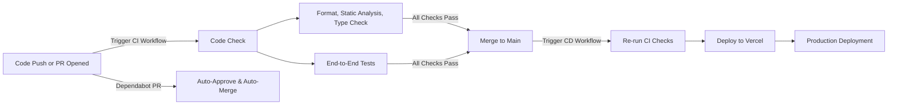

# CI/CD Pipeline for popcorn.fyi

## Overview

When I set out to build _popcorn.fyi_, I knew I wanted a CI/CD setup that was fast, reliable, and easy to maintain—basically something that wouldn't get in the way but would still keep the codebase in top shape. So, I leaned into **GitHub Actions** for the CI/CD pipeline and **Vercel** for deployments. The pipeline handles everything from code checks and linting to end-to-end testing, dependency updates, and seamless deployments.

## Architecture

Here’s the high-level view of how everything fits together:

1. **Version Control:** The entire project lives on GitHub.
2. **Continuous Integration (CI):** Every pull request triggers GitHub Actions workflows to ensure code quality.
3. **Dependency Management:** Dependabot keeps dependencies fresh, with auto-approval and auto-merge workflows.
4. **Continuous Deployment (CD):** Any successful merge to `main` gets automatically deployed to Vercel—because who wants to click deploy buttons?

## Workflow Breakdown

### 1. **CI Workflow**

Every time a pull request is opened, the CI workflow kicks in to make sure everything's in order.

- **Code Check:** This step runs tasks like formatting, static analysis, and type checking with tools like `manypkg`, `knip`, and `pnpm check`.
- **End-to-End Testing:** Using Playwright to run browser-based tests to catch anything that slips through unit tests.

[View CI Workflow](/.github/workflows/ci.yml)

### 2. **Dependabot Workflow**

No one likes outdated dependencies, but manually updating them is a pain. Enter Dependabot. This workflow handles:

- **Auto-Approve:** It automatically gives the thumbs up to PRs created by Dependabot.
- **Auto-Merge:** Once approved, it squashes and merges those updates. Easy.

[View Dependabot Workflow](/.github/workflows/dependabot.yml)

### 3. **CD Workflow**

Whenever a PR is merged into `main`, the CD workflow takes over.

- **Re-run CI Checks:** Just to be extra sure, it reruns the linting, type checks, and tests.
- **Deploy to Vercel:** If all checks pass, Vercel takes care of deploying the latest version to production.

**Trigger:**

```yaml
on:
  push:
    branches: [main]
```

## Key Features

Here’s what makes this CI/CD setup tick:

- **Fail Fast Strategy:** The pipeline stops at the first sign of failure to save time.
- **Parallel Jobs:** Code checks and E2E tests run in parallel to speed things up.
- **Turbo Caching:** TurboRepo’s remote caching keeps builds and tests fast.
- **Dependency Caching:** `pnpm` store caching reduces install times.
- **Playwright Reports:** Test reports are automatically uploaded for review.
- **Automated Dependency Management:** Dependabot handles updates with auto-approve and auto-merge, so you don’t have to.

## CI/CD Workflow Diagram

Here’s a visual of how it all flows:
a



## Future Enhancements

Like any good project, there’s always room for improvement:

- **Coverage Thresholds:** Add regression checks with Vitest to ensure test coverage doesn’t drop.
- **Visual Regression Testing:** Tools like Percy or Chromatic could help catch UI glitches.
- **Slack/Email Notifications:** Set up alerts for failed builds or deployments to stay in the loop.
- **Performance Budgets:** Prevent performance regressions by setting clear thresholds.

---

This CI/CD setup keeps _popcorn.fyi_ running smoothly, so I can focus on building cool features instead of worrying about deployments or broken builds.
