## **CI/CD Design**

```mermaid
flowchart LR
  A[💻 Code Push or PR Opened] -->|Trigger CI Workflow| B[📝 Code Check]
  A -->|🏷️ Label PR| L[🏷️ PR Auto-Labeling]
  A -->|🔧 Dependabot PR| C[✅ Auto-Approve & 🔀 Auto-Merge]

  B --> D[🛠️ Format, Static Analysis, Type Check]
  B --> E[☂️ Coverage Report Merge & Upload]
  B --> F[🌐 End-to-End Tests]

  subgraph "⚡ Caching Optimizations"
    X[🔄 Restore pnpm Cache]
    Y[🚀 TurboRepo Remote Cache]
  end

  X & Y --> D & E & F

  D & E & F -->|✔️ All Checks Pass| G[🔀 Merge to Main]
  G -->|Trigger CD Workflow| H[🔁 Re-run CI Checks]
  H --> I[🚀 Deploy to Vercel]
  I --> J[🎉 Production Deployment]
```



---

## **Overview**

Popcorn.fyi uses **GitHub Actions** to manage continuous integration workflows and **Vercel** for automatic deployments. The pipeline is designed to catch issues early, automate routine tasks like dependency updates and PR labeling, and deploy only after all checks pass.

---

## Key Components

1. **CI Workflow:** Runs on PRs and `main` branch. Performs:
   - Format check, linting, type checking
   - Unit/component tests (Vitest)
   - E2E tests (Playwright)
   - Coverage reporting (Codecov)

2. **CD Workflow:** Triggered by merges to `main`:
   - Re-runs CI checks
   - Deploys to Vercel

3. **PR Labeling:** Uses path-based rules to auto-tag PRs (e.g., `lib:ui`, `app:web`).

4. **Dependabot Automation:**
   - Auto-approves and merges when all checks pass

5. **Caching:**
   - Restores `pnpm` install cache
   - Uses **TurboRepo remote cache** to speed up builds and tasks

---

## Workflow Details

### CI Trigger

```yaml
on:
  pull_request:
    branches: [main]
  push:
    branches: [main]
```

### CD Trigger

```yaml
on:
  push:
    branches: [main]
```

CI always runs before deploys, ensuring no skipped validations.
