# 🚀 CI/CD Pipeline for popcorn.fyi

## 🔍 Overview

When I set out to build _popcorn.fyi_, I knew I wanted a CI/CD setup that was fast, reliable, and easy to maintain—basically something that wouldn't get in the way but would still keep the codebase in top shape. So, I leaned into **GitHub Actions** for the CI/CD pipeline and **Vercel** for deployments. The pipeline handles everything from code checks and linting to end-to-end testing, dependency updates, test coverage tracking, and seamless deployments.

## 🏗️ Architecture

Here’s the high-level view of how everything fits together:

1. **🔧 Version Control:** The entire project lives on GitHub.
2. **🔄 Continuous Integration (CI):** Every pull request triggers GitHub Actions workflows to ensure code quality.
3. **📦 Dependency Management:** Dependabot keeps dependencies fresh, with auto-approval and auto-merge workflows.
4. **📊 Test Coverage Tracking:** Code coverage reports are merged and uploaded to Codecov to track test quality.
5. **🚚 Continuous Deployment (CD):** Any successful merge to `main` gets automatically deployed to Vercel—because who wants to click deploy buttons?

## 🔁 Workflow Breakdown

### 1. **🧪 CI Workflow**

Every time a pull request is opened, the CI workflow kicks in to make sure everything's in order.

- **📝 Code Check:** This step runs tasks like formatting, static analysis, and type checking with tools like `manypkg`, `knip`, and `pnpm check`.
- **☂️ Coverage Reporting:** Merges coverage reports and uploads them to Codecov for tracking.
- **🌐 End-to-End Testing:** Using Playwright to run browser-based tests to catch anything that slips through unit tests.

[View CI Workflow](/.github/workflows/ci.yml)

### 2. **📦 Dependabot Workflow**

No one likes outdated dependencies, but manually updating them is a pain. Enter Dependabot. This workflow handles:

- **✅ Auto-Approve:** It automatically gives the thumbs up to PRs created by Dependabot.
- **🔀 Auto-Merge:** Once approved, it squashes and merges those updates. Easy.

[View Dependabot Workflow](/.github/workflows/dependabot.yml)

### 3. **🚚 CD Workflow**

Whenever a PR is merged into `main`, the CD workflow takes over.

- **🔁 Re-run CI Checks:** Just to be extra sure, it reruns the linting, type checks, and tests.
- **🚀 Deploy to Vercel:** If all checks pass, Vercel takes care of deploying the latest version to production.

**Trigger:**

```yaml
on:
  push:
    branches: [main]
```

## 🔑 Key Features

Here’s what makes this CI/CD setup tick:

- **⛔ Fail Fast Strategy:** The pipeline stops at the first sign of failure to save time.
- **🔀 Parallel Jobs:** Code checks and E2E tests run in parallel to speed things up.
- **⚡ Turbo Caching:** TurboRepo’s remote caching keeps builds and tests fast.
- **📦 Dependency Caching:** `pnpm` store caching reduces install times.
- **☂️ Code Coverage Reports:** Coverage data is merged and uploaded to Codecov to track test health.
- **📊 Playwright Reports:** Test reports are automatically uploaded for review.
- **🤖 Automated Dependency Management:** Dependabot handles updates with auto-approve and auto-merge, so you don’t have to.

## 📈 CI/CD Workflow Diagram

Here’s a visual of how it all flows:

```mermaid
flowchart LR
  A[💻 Code Push or PR Opened] -->|Trigger CI Workflow| B[📝 Code Check]
  A -->|🔧 Dependabot PR| C[✅ Auto-Approve & 🔀 Auto-Merge]
  B --> D[🛠️ Format, Static Analysis, Type Check]
  B --> E[☂️ Coverage Report Merge & Upload]
  B --> F[🌐 End-to-End Tests]
  D & E & F -->|✔️ All Checks Pass| G[🔀 Merge to Main]
  G -->|Trigger CD Workflow| H[🔁 Re-run CI Checks]
  H --> I[🚀 Deploy to Vercel]
  I --> J[🎉 Production Deployment]
```



## 🔮 Future Enhancements

Like any good project, there’s always room for improvement:

- **🖼️ Visual Regression Testing:** Tools like Percy or Chromatic could help catch UI glitches.
- **📢 Slack/Email Notifications:** Set up alerts for failed builds or deployments to stay in the loop.
- **🚦 Performance Budgets:** Prevent performance regressions by setting clear thresholds.

---

This CI/CD setup keeps _popcorn.fyi_ running smoothly, so I can focus on building cool features instead of worrying about deployments or broken builds.
