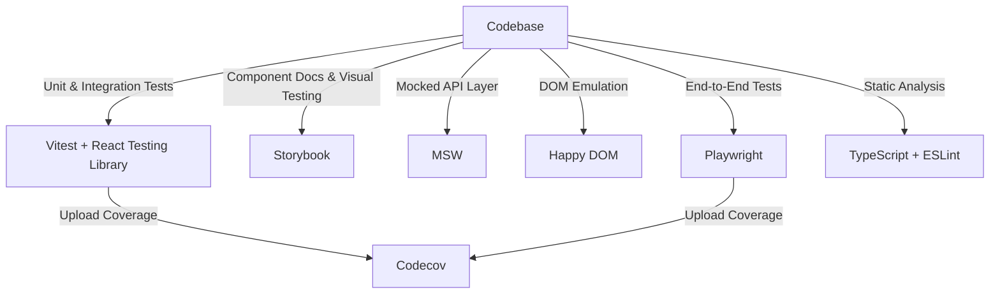

## **Testing Design**



---

## **Overview**

Popcorn.fyi uses a layered testing strategy focused on reliability, speed, and developer feedback. It combines static analysis, unit tests, component tests, and full browser-based end-to-end testing. All test types run in CI, with coverage tracked via Codecov.

---

## Key Components

1. **Static Analysis:**
   - Type checking with **TypeScript**
   - Linting with **ESLint**

2. **Unit & Integration Testing:**
   - **Vitest** with **React Testing Library**
   - Fast, type-safe, and focused on component behavior

3. **UI Component Testing:**
   - **Storybook** for interactive development and isolated testing of `@popcorn.fyi/ui`

4. **Mocking:**
   - **MSW (Mock Service Worker)** to simulate network requests in tests
   - **Happy DOM** for fast, lightweight DOM testing during unit/integration runs

5. **End-to-End Testing:**
   - **Playwright** simulates real user flows across multiple browsers
   - Used in CI to validate navigation and page content

6. **Custom Test Utilities:**
   - Centralized render helpers (`@/testing/utils`)
   - Wraps components with routing, state, and auth context for realistic tests

7. **Coverage Reporting:**
   - Tests upload results to **Codecov**
   - Used to enforce thresholds and monitor test health over time

---

## Example Structure

```text
src/
  movie/
    movie-card.tsx
    movie-card.test.tsx
  tv-show/
    trending-carousel.tsx
    trending-carousel.test.tsx
libs/
  ui/
    button.tsx
    button.test.tsx
    button.stories.tsx
```

---

## Example: Unit Test (Vitest)

```tsx
import { render, screen } from "@/testing/utils";
import { MovieCard } from "./movie-card";

describe("MovieCard", () => {
  it("renders title and release year", () => {
    render(
      <MovieCard movie={{ title: "Inception", releaseDate: "2010-07-16" }} />,
    );
    expect(screen.getByText("Inception")).toBeInTheDocument();
    expect(screen.getByText("2010")).toBeInTheDocument();
  });
});
```

---

## Example: E2E Test (Playwright)

```ts
import { test, expect } from "@playwright/test";

test("navigates to Movies page", async ({ page }) => {
  await page.goto("/");
  await page.click("text=Discover");
  await page.click("text=Movies");
  await expect(page).toHaveURL("/discover/movies");
  await expect(page.getByText("Popular Movies")).toBeVisible();
});
```

---

## Example: Mocking with MSW

```tsx
import { rest } from "msw";
import { setupServer } from "msw/node";
import { render, screen } from "@/testing/utils";
import { MovieList } from "./movie-list";

const server = setupServer(
  rest.get("/api/movies", (req, res, ctx) => {
    return res(
      ctx.json([
        { id: 1, title: "Inception" },
        { id: 2, title: "Interstellar" },
      ]),
    );
  }),
);

describe("MovieList", () => {
  it("renders mocked movie list", async () => {
    render(<MovieList />);
    expect(await screen.findByText("Inception")).toBeInTheDocument();
    expect(await screen.findByText("Interstellar")).toBeInTheDocument();
  });
});
```

---

## Coverage & CI

- **Codecov** collects and merges coverage data across test runs.
- **Playwright** runs in Chromium, Firefox, and WebKit.
- **CI runs all test types**, using caching to speed up execution.

---

This strategy helps ensure _popcorn.fyi_ stays fast, stable, and confidently shippable.
